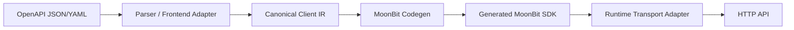

# oas2moon

OpenAPI 3.0.x JSON/YAML → a typed MoonBit HTTP client SDK.

`oas2moon` accepts a supported OpenAPI document and emits a self-contained MoonBit package: models, typed async operations, configuration, encoding, and the runtime transport adapter. The measured corpus contains an official archived Petstore 3.0 sample, the project Petstore fixture, and curated GitHub/OpenAI/JSONPlaceholder subsets; it is not a claim of whole-spec OpenAPI compatibility.

## Architecture and authority



The parser AST/Frontend Model records input facts; it is **not** a Codegen input. Canonical Client IR is the sole authority consumed by Codegen. HTTP behaviour is concentrated in the generated runtime transport adapter, rather than scattered through operations.

Production semantics are MoonBit-first:

| Layer | Implementation | Responsibility |
|---|---|---|
| Frontend adapter | `src/frontend_adapter/` (MoonBit) | Parse supported JSON/YAML and form project-owned input facts |
| Validation, naming, type mapping, Canonical Client IR | `src/core_moonbit/` (MoonBit) | Generator authority |
| Codegen | `src/codegen_moonbit/` (MoonBit) | Emit the SDK from IR only |
| Runtime transport | `src/runtime_moonbit/` (MoonBit) | Requests, auth, response/error handling, real HTTP |
| CLI and test support | Python / PowerShell | Orchestrate stages, fixture server, test harness and demo support only |

Python does not parse OpenAPI, decide names/types, construct IR, or emit SDK source. `docs/ARCHITECTURE.md` explains the boundary in more detail.

## Quick start

Prerequisites: Python 3.12+, MoonBit (`moon` on `PATH`), PowerShell 7 for the demo, and a native C toolchain (MSVC on Windows; `cc` on Ubuntu).

```pwsh
python oas2moon.py generate fixtures/petstore/openapi.json `
  --module oas2moon/petstore_demo --out ./generated/petstore `
  --ir-out ./generated/canonical.json

Push-Location ./generated/petstore
moon fmt --check
moon check --target native --deny-warn
moon test --target native --deny-warn
Pop-Location
```

The generated `client.mbt` exposes typed async operation calls; required parameters are positional and optional parameters are labelled. To execute the same package against a strict real loopback HTTP server, run:

```pwsh
pwsh -NoProfile -File demo/petstore/run_demo.ps1
```

The demo runs the product CLI, adds test-only CaptureTransport tests, runs `moon fmt`, `moon check`, and `moon test`, then has a generated MoonBit client perform CRUD, authentication and error-path calls to the local fixture server. It also compares two fresh SDK trees byte-for-byte. See [`demo/petstore/README.md`](demo/petstore/README.md) for artifacts and manual stages.

## Evidence-backed status

The following are evidence claims, not broad compatibility promises:

| Claim | Executable evidence |
|---|---|
| CLI generation, JSON/YAML, local refs, typed Petstore CRUD | `python -m pytest tests -q`; `demo/petstore/run_demo.ps1` |
| Generated package formatting, native compilation and tests | Demo steps 3–5; CI workflow |
| Real HTTP request shape, typed decode, 204, four auth modes, HTTP/configuration errors | Demo steps 6–11 with `demo/petstore/fixture_server.py` |
| Deterministic output | Demo step 12 and `tests/test_t13_determinism.py` |
| Bounded real-world corpus generation and compilation | `python tools/corpus_metrics.py --json-out tests/_build/corpus-metrics/summary.json --report-out docs/CORPUS_REPORT.md`; 5/5 real-world specs compiled and 12/12 operations were supported |
| Hosted Ubuntu and Windows verification | [cross-platform-ci run 35298853128](https://github.com/Atman-Angle/oas2moon/actions/runs/35298853128), commit `11acf9e`: both jobs `success` |

The CI workflow is [`.github/workflows/cross-platform-ci.yml`](.github/workflows/cross-platform-ci.yml). It runs MoonBit package checks, determinism tests, the Python suite, and the real-HTTP demo on `ubuntu-latest` and `windows-latest`. It does not establish compatibility beyond the checked fixture set.

## Supported profile and limits

The evidence classification and exact semantics are in [`docs/SUPPORTED_OPENAPI.md`](docs/SUPPORTED_OPENAPI.md). In short, the tested profile includes OpenAPI 3.0.0–3.0.3 JSON/common YAML, local refs, common models, GET/POST/PUT/PATCH/DELETE, JSON bodies/responses, common path/query/header serialization, and Bearer/Basic/API-key auth.

V1 does not support OpenAPI 3.1, external/network `$ref`, `oneOf`, `anyOf`, `discriminator`, multipart, XML, callbacks/webhooks, OAuth authorization flows, or arbitrary parameter serialization styles. Unsupported semantics must produce a stable diagnostic; a `Json` fallback is permitted only where documented wire behaviour stays correct.

Known evidence gaps: the corpus is deliberately bounded to one full archived OAI Petstore sample plus project/curated subsets, so it does not establish full GitHub/OpenAI support or arbitrary-document compatibility. Response enums and `UnsupportedMediaType` also lack a real-HTTP demo case.

## Release material

- [Support matrix](docs/SUPPORTED_OPENAPI.md)
- [Acceptance and release evidence](docs/ACCEPTANCE.md)
- [Measured corpus report](docs/CORPUS_REPORT.md)
- [Five-minute defence demo](docs/DEMO_SCRIPT.md)
- [Third-party notices](THIRD_PARTY_NOTICES.md)
- [Repository hygiene and migration direction](docs/REPOSITORY_HYGIENE.md)
- [Change log](CHANGELOG.md)

## License

Distributed under the [MIT License](LICENSE).
